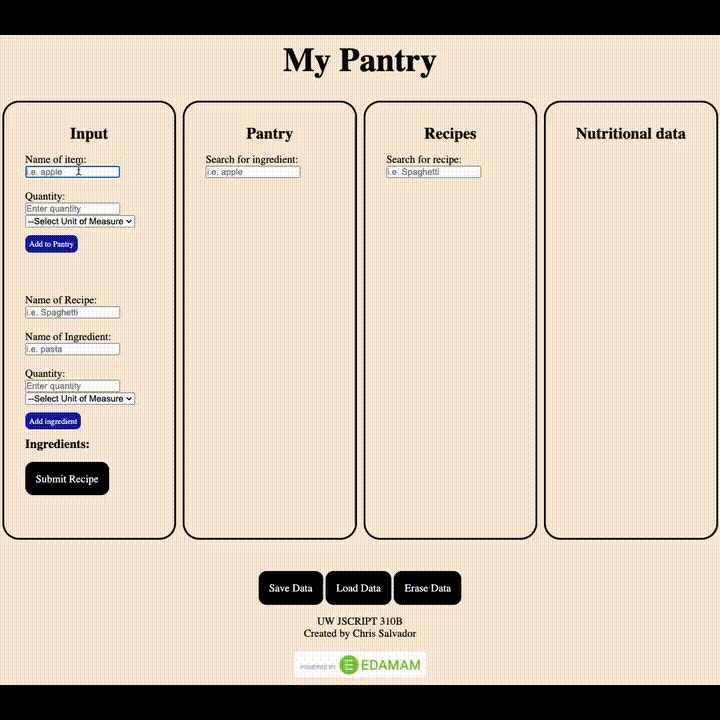

# uw-jscript310b-final-project-my-pantry

<!-- TABLE OF CONTENTS -->

  
Table of Contents

  <ol>
    <li>
      <a href="#about-the-project">About The Project</a>
    </li>
    <li>
      <a href="#built-with">Built With</a>
    </li>
    <li>
      <a href="#instructions">Instructions</a>
    </li>
    <li>
      <a href="#ui-description">UI Description</a>
    </li>
    <li>
      <a href="#recap">Recap</a>
    </li>
  </ol>

 

<!-- ABOUT THE PROJECT -->

## About The Project

My Pantry tracks ingredients stored in your pantry by user entries. The user has the ability to add/remove ingredients, update the quantity, and change the unit of measurement. The user can also create recipes and fetch nutritional data.
 

 

(<a href="#readme-top">back to top</a>)

## Built With

- HTML
- CSS
- JavaScript

## Instructions

1. For Edamam Nutritional API, sign-up for api key here at https://www.edamam.com/. Place APP_ID and API_KEY into an 'api-key.js' file and place in root of project folder.

2. Run index.html

## UI Description

- Entering an ingredient:
  Complete form fields in the input section then click 'Add to Pantry' which runs validation checks before listing the ingredient in the Pantry section.

- Updating quantity:
  Complete form with same ingredient name. To add to current quantity, enter a positive number. To decrease quantity, enter a negative number.

- Create a Recipe:
  Complete form fields in the input section and click 'Add ingredient' which runs validation checks before listing the item in the ingredient section. You can also click on the 'Add to recipe' button for any ingredient listed in the Pantry section to populate the name and unit of measure instead of manual typing. Click 'Submit Recipe' to run validation checks and store the recipe in the Recipe section.

- Recipe section:
  The 'View' button allows to view the ingredients assigned to the stored recipe. The 'Data' button will run a fetch to the Nutritional Analysis API to gather nutritional information based on the individual ingredients in the recipe. The results are displayed in the Nutritional data section.

- Save/Load/Erase:
  'Save Data' and 'Load Data' button will set and get the pantry and recipe data to/from local storage. 'Erase Data' will erase pantry, recipe, and local storage data.

Other Notes:

- Nutritional Analysis API
  Source: https://www.edamam.com

## Recap

This project was created for a Javascript course during the Full-Stack Development certificate program at [University of Washington - PCE](https://www.pce.uw.edu/). The intended requirements for the project was strictly HTML, CSS, and JS. My plan for this project is to continue iterating on the design as I continue through my Full-Stack program. I love to cook and at times found myself needing a better way to track my pantry. This project has been updated, [click here to view](https://github.com/csalvador58/uw-jscript320b-final-project-my-pantry).

Some highlights in this project:
- Made use of JS classes for ingredients and recipes
- Search feature for item and recipes
- Integration with a Food nutritional API

My thoughts for improvement include:
- Improve UX/UI by design for mobile screen and on the go use
- Have multi pages (i.e. Pantry Item input, Pantry list, Recipes, etc)

(<a href="#readme-top">back to top</a>)
